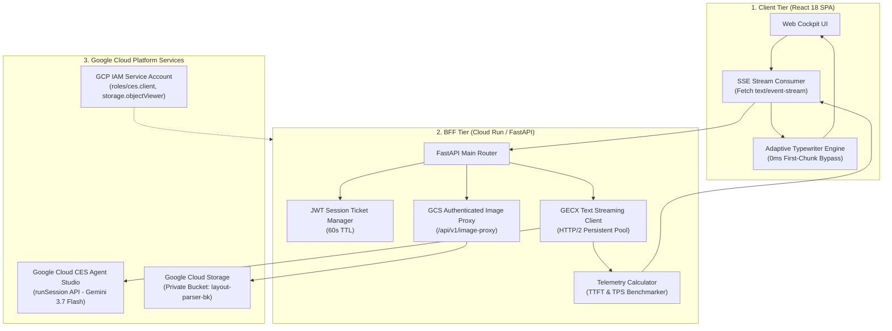
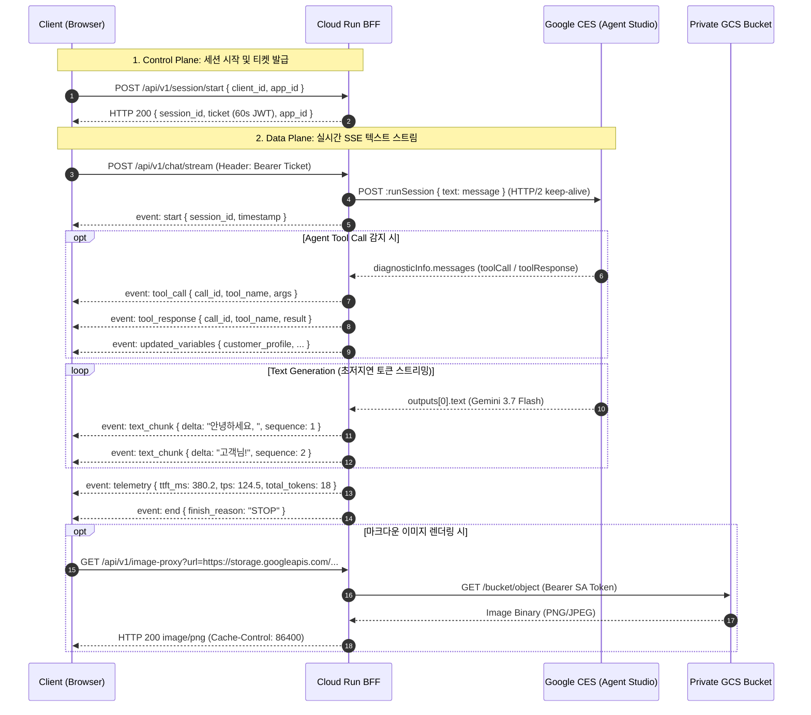
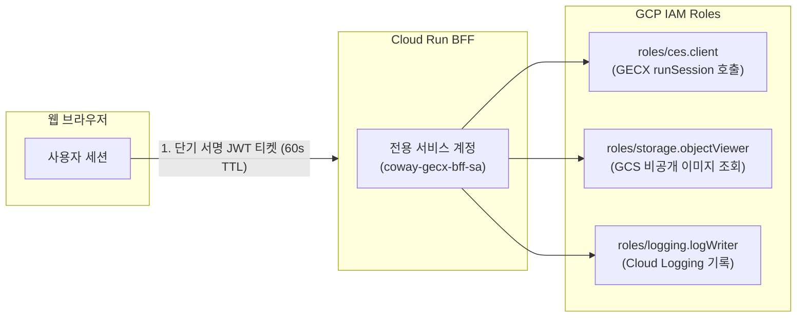

# Coway GECX Real-Time Text Streaming & Cockpit Console

[](https://cloud.google.com/run)
[](https://cloud.google.com/customer-engagement-ai/conversational-agents/ps)
[](https://deepmind.google/technologies/gemini/)
[](https://fastapi.tiangolo.com/)
[](https://react.dev/)
[](https://tailwindcss.com/)

> **Google Cloud Customer Engagement Suite (CES / GECX)의 `Gemini 3.7 Flash` 모델을 기반으로 하는 실시간 텍스트 토큰 스트리밍(SSE) 및 웹 콘솔 솔루션 마스터 아키텍처 명세서입니다.**

---

## 1. 시스템 아키텍처 (System Architecture)

본 솔루션은 **FastAPI 기반 Backend-For-Frontend (BFF)**와 **React 18 웹 콕핏 클라이언트**로 구성되어 있으며, Google Cloud CES(Customer Engagement Suite) 에이전트 엔진과 HTTP/2 기반으로 실시간 통신합니다.



---

## 2. 실시간 SSE 스트리밍 시퀀스 (Streaming Protocol Sequence)

HTTP/2 표준 **Server-Sent Events (`text/event-stream`)** 프로토콜을 사용하여 제어 신호, 도구 실행 로그, 텍스트 토큰 및 텔레메트리 메트릭을 단일 파이프라인으로 전송합니다.



---

## 3. 핵심 최적화 알고리즘 (Key Engineering Optimizations)

### 3.1. Hyper-TTFT 최적화 (Time-To-First-Token)
* **Persistent Connection Pooling**: `httpx.AsyncClient`에 `httpx.Limits(max_keepalive_connections=50, max_connections=100, keepalive_expiry=30.0)`를 적용하여 GCP CES API와의 SSL/TLS 핸드셰이크 오버헤드를 제거.
* **Zero-Delay First Chunk Bypass**: 사용자가 응답을 즉각 인지할 수 있도록 첫 번째 토큰 청크(`sequence: 1`)는 타자기 큐 지연 없이 0ms로 즉시 렌더링.

### 3.2. 적응형 타자기 엔진 (Adaptive Typewriter Engine)
네트워크 지연으로 청크가 뭉쳐서 도착하는 현상(Token Bursting)을 방지하기 위해 잔여 버퍼 크기에 따라 렌더링 속도를 동적으로 가속하는 알고리즘을 적용했습니다.

$$\text{Pacing Delay (ms)} = \max\left(5.0, \frac{\text{Base Delay (15ms)}}{1 + 0.15 \times \text{Backlog Count}}\right)$$

---

## 4. 데이터 스키마 및 이벤트 명세 (Data Contracts)

### 4.1. SSE 이벤트 페이로드 명세

| Event Name | Payload Structure | 설명 |
| :--- | :--- | :--- |
| `event: start` | `{"session_id": str, "app_id": str, "timestamp": float}` | 스트림 시작 신호 |
| `event: updated_variables` | `{"variable_name": value, ...}` | 세션 컨텍스트 및 변수 갱신 데이터 |
| `event: tool_call` | `{"call_id": str, "tool_name": str, "args": dict}` | AI 에이전트 도구 호출 인자 |
| `event: tool_response` | `{"call_id": str, "tool_name": str, "result": dict}` | 도구 실행 결과 반환값 |
| `event: text_chunk` | `{"delta": str, "sequence": int}` | 실시간 증분 텍스트 토큰 청크 |
| `event: telemetry` | `{"ttft_ms": float, "tps": float, "total_tokens": int, "model": "gemini-3.7-flash"}` | 레이턴시 및 처리량 벤치마크 메트릭 |
| `event: end` | `{"finish_reason": "STOP"}` | 턴 완료 및 스트림 종료 신호 |

---

## 5. 보안 및 권한 아키텍처 (Security & IAM Architecture)



* **Signed URL 미사용 원리**: GCS 버킷을 퍼블릭(`allUsers`)으로 개방하지 않고, Cloud Run 서비스 계정의 `roles/storage.objectViewer` 권한을 활용한 **BFF Image Proxy (`/api/v1/image-proxy`)**를 통해 비공개 이미지를 안전하게 중계 스트리밍합니다.
* **제어/데이터 플레인 분리**: REST API(`/api/v1/session/start`)에서 발급된 60초 유효기간의 서명된 JWT 티켓으로만 스트리밍 엔드포인트 접근을 허용합니다.

---

## 6. 빠른 시작 및 배포 가이드 (Quick Start)

### 6.1. Claude Code를 통한 원클릭 배포 (권장)
고객사 환경에서 Claude Code를 사용할 경우 아래 명령어로 자동 배포를 수행할 수 있습니다.

```bash
cd coway-gecx-text-streaming
claude
```
> **프롬프트 예시:** *"우리 GCP 환경(Project ID: <고객사_PROJECT_ID>, App ID: <고객사_APP_ID>, Deployment ID: <고객사_DEPLOYMENT_ID>)에 맞게 GECX 텍스트 스트리밍 서비스를 Cloud Run에 배포해줘."*

---

### 6.2. 대화형 배포 마법사 스크립트
```bash
cd coway-gecx-text-streaming
./scripts/customer_wizard_deploy.sh
```

---

### 6.3. 배포 리소스 정리 및 삭제 (안전 더블체크)
```bash
cd coway-gecx-text-streaming
./scripts/cleanup_resources.sh
```
*(본 솔루션 전용 Cloud Run 서비스 및 서비스 계정만 식별한 후 프로젝트 ID 확인을 거쳐 안전하게 삭제합니다.)*

---

### 6.4. 로컬 실행 및 20개 테스트 스위트
```bash
# 로컬 가상환경 구성
./scripts/setup_env.sh

# 로컬 서버 실행 (http://localhost:8080)
./scripts/run_local.sh

# 20개 단위 및 통합 테스트 전수 실행
.venv/bin/python -m unittest discover tests -v
```

---

## 7. 문서 색인

* [엔지니어 배포 가이드 (docs/CUSTOMER_DEPLOYMENT_GUIDE.md)](docs/CUSTOMER_DEPLOYMENT_GUIDE.md) - GCP 콘솔 로그인부터 상세 배포 절차 가이드
* [종합 테스트 결과 보고서 (docs/TEST_REPORT.md)](docs/TEST_REPORT.md) - 20개 테스트 케이스 전수 검증 결과서
* [Claude Code 지침서 (CLAUDE.md)](CLAUDE.md) - Claude Code CLI 전용 인스트럭션 가이드
