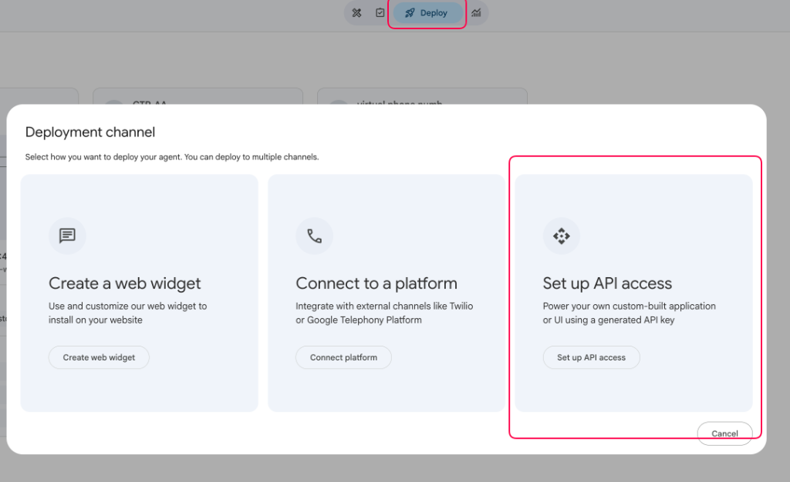
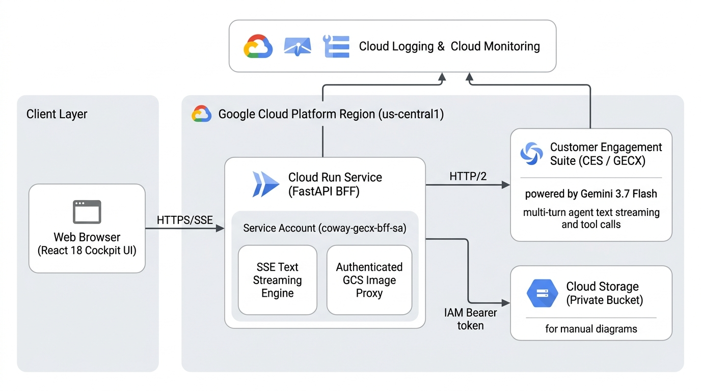
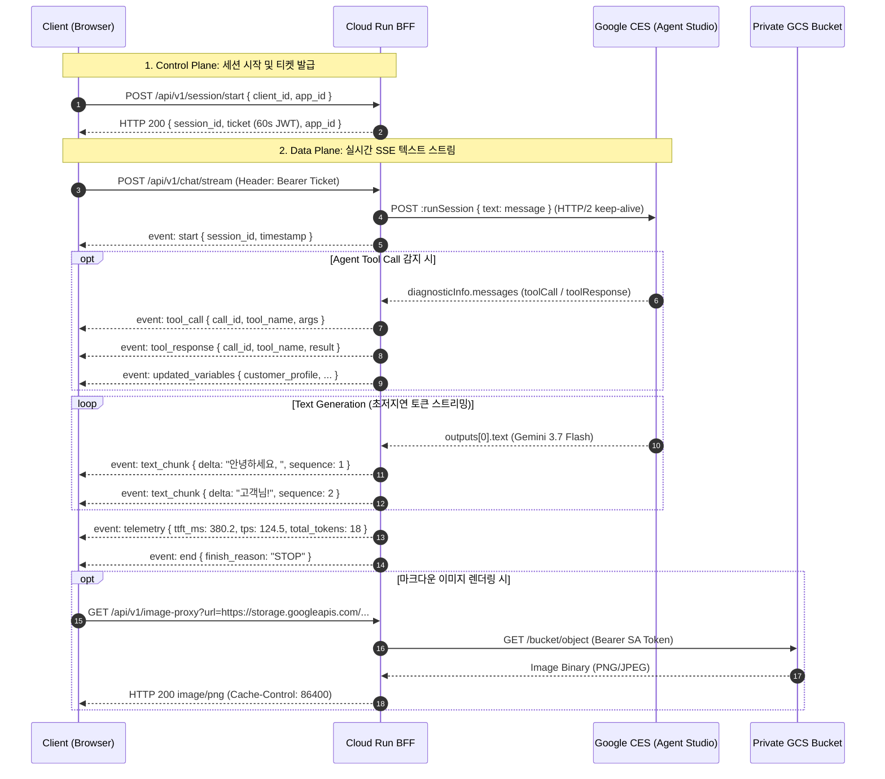

# GECX Real-Time Text Streaming

[](https://cloud.google.com/run)
[](https://cloud.google.com/customer-engagement-ai/conversational-agents/ps)
[](https://deepmind.google/technologies/gemini/)
[](https://fastapi.tiangolo.com/)
[](https://react.dev/)
[](https://tailwindcss.com/)

> **Google Cloud Customer Engagement Suite (CES / GECX)의 `Gemini 3.7 Flash` 모델을 기반으로 하는 실시간 텍스트 토큰 스트리밍(SSE) 및 웹 콘솔 솔루션 마스터 기술 명세서입니다.**

---

## 1. 사전 작업: CX Agent Studio API 접근 설정 (Prerequisite)

커스텀 웹 챗봇 및 BFF 서버를 CES 에이전트와 연동하려면, 먼저 **CX Agent Studio** 콘솔에서 API 접근 권한(Deployment Channel)을 활성화해야 합니다.



### 1.1. 설정 단계
1. **Google Cloud 콘솔 접속**: [CX Agent Studio](https://ces.cloud.google.com/)에서 대상 에이전트 앱으로 이동합니다.
2. **Deploy 메뉴 선택**: 화면 상단 중앙의 **`Deploy`** 버튼을 클릭합니다.
3. **Set up API access 활성화**: **Deployment channel** 팝업창에서 **`Set up API access`** 카드를 선택합니다.
4. **App ID 및 Deployment ID 확인**:
   * **App ID**: 브라우저 URL의 `apps/{APP_ID}`에 해당하는 고유 UUID
   * **Deployment ID**: 생성된 API 채널의 고유 식별자 (`0b7d820b-375b-...`)
   * 위 2개 ID를 배포 마법사 또는 `.env` 설정에 입력합니다.

---

## 2. Google Cloud 엔터프라이즈 아키텍처 (Enterprise Architecture)



### 2.1. 계층별 아키텍처 구성 및 역할

본 솔루션은 보안성과 초저지연 성능을 극대화하기 위해 **Client Layer**, **Cloud Run BFF Layer**, **GCP Managed Services Layer**의 3계층 구조로 설계되었습니다.

1. **Client Layer (사용자 웹 브라우저)**:
   * **React 18 SPA Cockpit**: 가볍고 직관적인 UI 콘솔로 실시간 텍스트 스트리밍과 도구 호출(Tool Call) 로그를 동시 렌더링합니다.
   * **Adaptive Typewriter Engine**: 네트워크 패킷 뭉침(Bursting) 현상을 완화하고 자연스러운 타자기 애니메이션을 제공하며, 최초 1회 토큰 청크는 **0ms 즉시 바이패스**하여 체감 응답 속도(TTFT)를 극대화합니다.
   * **단일 SSE 스트림 파이프라인**: `POST /api/v1/chat/stream` 단일 HTTP 연결을 통해 시작, 도구 호출, 텍스트 토큰, 텔레메트리, 종료 신호를 안정적으로 수신합니다.

2. **Cloud Run Service (FastAPI BFF Tier - `us-central1`)**:
   * **Control / Data Plane 분리**: `/api/v1/session/start`에서 발급한 60초 유효기간의 단기 서명 JWT 티켓으로 스트리밍 연결을 엄격히 통제합니다.
   * **SSE Text Streaming Engine**: Google CES 백엔드와의 Persistent Connection Pool(`httpx.AsyncClient` HTTP/2)을 유지하여 연결 수립 지연을 최소화합니다.
   * **Authenticated GCS Image Proxy**: 브라우저에 임시 URL(Signed URL)을 발급하는 대신, 서버 전용 서비스 계정(`gecx-bff-sa`)의 IAM 권한을 사용하여 비공개 GCS 버킷(`layout-parser-bk`) 내 매뉴얼/다이어그램 이미지를 안전하게 실시간 중계 렌더링합니다.

3. **Google Cloud Managed Services Layer**:
   * **Customer Engagement Suite (CES / GECX)**: **Gemini 3.7 Flash** 기반의 대화형 에이전트 엔진으로 멀티턴 컨텍스트 관리, 사전 상담 라우팅, 파이썬 도구 호출(Tool Call)을 지능적으로 오케스트레이션합니다.
   * **Cloud Storage (Private Bucket)**: 제품 매뉴얼 및 필터 구성 다이어그램 등의 정적 자산을 비공개 상태로 안전하게 보관합니다.
   * **Cloud Logging & Monitoring**: 전 구간 종단간 레이턴시(TTFT, E2E Latency)와 처리량(TPS) 텔레메트리를 실시간으로 관측 및 추적합니다.

---

## 3. 실시간 SSE 스트리밍 시퀀스 (Streaming Protocol Sequence)

HTTP/2 표준 **Server-Sent Events (`text/event-stream`)** 프로토콜을 사용하여 제어 신호, 도구 실행 로그, 텍스트 토큰 및 텔레메트리 메트릭을 단일 파이프라인으로 전송합니다.



---

## 4. 핵심 최적화 알고리즘 (Key Engineering Optimizations)

### 4.1. Hyper-TTFT 최적화 (Time-To-First-Token)
* **Persistent Connection Pooling**: `httpx.AsyncClient`에 `httpx.Limits(max_keepalive_connections=50, max_connections=100, keepalive_expiry=30.0)`를 적용하여 GCP CES API와의 SSL/TLS 핸드셰이크 오버헤드를 제거.
* **Zero-Delay First Chunk Bypass**: 사용자가 응답을 즉각 인지할 수 있도록 첫 번째 토큰 청크(`sequence: 1`)는 타자기 큐 지연 없이 0ms로 즉시 렌더링.

### 4.2. 적응형 타자기 엔진 (Adaptive Typewriter Engine)
* **자연스러운 텍스트 표출**: AI가 단어를 생성할 때마다 실제 사람이 타이핑하듯 부드럽게 화면에 렌더링합니다.
* **동적 속도 자동 조절 (지연 버퍼 가속)**: 네트워크 일시 지연 등으로 인해 뒤늦게 글자들이 한꺼번에 쏟아져 들어올 경우, 대기 중인 글자량에 비례하여 타이핑 속도를 자동으로 빠르게 올려 화면 멈춤 없이 매끄러운 읽기 경험을 제공합니다.

---

## 5. 데이터 스키마 및 이벤트 명세 (Data Contracts)

### 5.1. SSE 이벤트 페이로드 명세

| Event Name | Payload Structure | 설명 |
| :--- | :--- | :--- |
| `event: start` | `{"session_id": str, "app_id": str, "timestamp": float}` | 스트림 시작 신호 |
| `event: updated_variables` | `{"variable_name": value, ...}` | 세션 컨텍스트 및 변수 갱신 데이터 |
| `event: tool_call` | `{"call_id": str, "tool_name": str, "args": dict}` | AI 에이전트 도구 호출 인자 |
| `event: tool_response` | `{"call_id": str, "tool_name": str, "result": dict}` | 도구 실행 결과 반환값 |
| `event: text_chunk` | `{"delta": str, "sequence": int}` | 실시간 증분 텍스트 토큰 청크 |
| `event: telemetry` | `{"ttft_ms": float, "tps": float, "total_tokens": int, "model": "gemini-3.7-flash"}` | 레이턴시 및 처리량 벤치마크 메트릭 |
| `event: end` | `{"finish_reason": "STOP"}` | 턴 완료 및 스트림 종료 신호 |

---

## 6. 보안 및 권한 아키텍처 (Security & IAM Architecture)

* **Signed URL 미사용 원리**: GCS 버킷을 퍼블릭(`allUsers`)으로 개방하지 않고, Cloud Run 서비스 계정의 `roles/storage.objectViewer` 권한을 활용한 **BFF Image Proxy (`/api/v1/image-proxy`)**를 통해 비공개 이미지를 안전하게 중계 스트리밍합니다.
* **제어/데이터 플레인 분리**: REST API(`/api/v1/session/start`)에서 발급된 60초 유효기간의 서명된 JWT 티켓으로만 스트리밍 엔드포인트 접근을 허용합니다.

---

## 7. 빠른 시작 및 배포 가이드 (Quick Start)

### 7.1. Claude Code를 통한 원클릭 배포 (권장)
고객사 환경에서 Claude Code를 사용할 경우 아래 명령어로 자동 배포를 수행할 수 있습니다.

```bash
cd GECX-Real-Time-Text-Streaming
claude
```
> **프롬프트 예시:** *"우리 GCP 환경(Project ID: <고객사_PROJECT_ID>, App ID: <고객사_APP_ID>, Deployment ID: <고객사_DEPLOYMENT_ID>)에 맞게 GECX 텍스트 스트리밍 서비스를 Cloud Run에 배포해줘."*

---

### 7.2. 대화형 배포 마법사 스크립트
```bash
cd GECX-Real-Time-Text-Streaming
./scripts/customer_wizard_deploy.sh
```

---

### 7.3. 배포 리소스 정리 및 삭제 (안전 더블체크)
```bash
cd GECX-Real-Time-Text-Streaming
./scripts/cleanup_resources.sh
```
*(본 솔루션 전용 Cloud Run 서비스 및 서비스 계정만 식별한 후 프로젝트 ID 확인을 거쳐 안전하게 삭제합니다.)*

---

### 7.4. 로컬 실행 및 20개 테스트 스위트
```bash
# 로컬 가상환경 구성
./scripts/setup_env.sh

# 로컬 서버 실행 (http://localhost:8080)
./scripts/run_local.sh

# 20개 단위 및 통합 테스트 전수 실행
.venv/bin/python -m unittest discover tests -v
```

---

## 8. 문서 색인

* [엔지니어 배포 가이드 (docs/CUSTOMER_DEPLOYMENT_GUIDE.md)](docs/CUSTOMER_DEPLOYMENT_GUIDE.md) - GCP 콘솔 로그인부터 상세 배포 절차 가이드
* [종합 테스트 결과 보고서 (docs/TEST_REPORT.md)](docs/TEST_REPORT.md) - 20개 테스트 케이스 전수 검증 결과서
* [Claude Code 지침서 (CLAUDE.md)](CLAUDE.md) - Claude Code CLI 전용 인스트럭션 가이드
