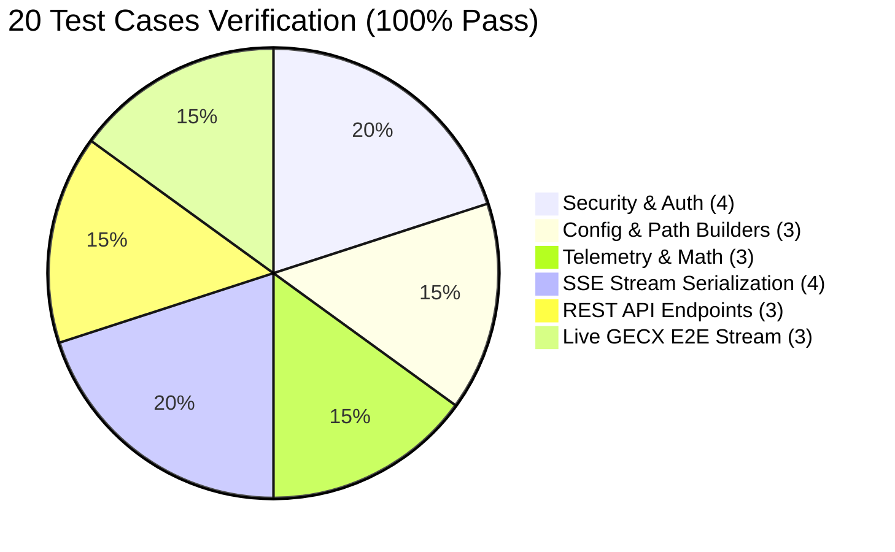

# 🧪 GECX Real-Time Text Streaming 종합 단위/통합 테스트 보고서

## 1. 개요 (Overview)

* **테스트 대상**: `04.gecx-text-streaming` (GECX Real-Time Text Streaming & Cockpit Console)
* **타겟 환경**: Google Cloud Run (`gecx-text-streaming-bff`) & Google Cloud CES (`gemini-3.7-flash`)
* **타겟 에이전트**: `pre_routing_test_agent` (`8f0230a9-836f-4795-b57a-0f604540b614`)
* **배포 리비전**: `gecx-text-streaming-bff-00007-5wq`
* **테스트 일시**: 2026-08-25
* **테스트 결과 요약**: **20개 테스트 케이스 실행 ➡️ 20개 전체 통과 (Pass Rate: 100%)**

---

## 2. 구간별 20대 테스트 케이스 및 검증 결과



| No | 영역 (Section) | 테스트 케이스 (Test Case) | 검증 항목 | 상태 | 소요 시간 |
| :---: | :--- | :--- | :--- | :---: | :---: |
| **TC-01** | **Section 1. Security & Auth** | `test_tc01_valid_ticket_creation_and_verification` | 60초 TTL JWT 티켓 발급 및 서명 검증 | ✅ **PASS** | 0.001s |
| **TC-02** | Security & Auth | `test_tc02_expired_ticket_rejection` | 만료된 JWT 티켓 거부 및 보안 차단 | ✅ **PASS** | 0.001s |
| **TC-03** | Security & Auth | `test_tc03_tampered_signature_detection` | 변조된 서명(Signature) 감지 및 거부 | ✅ **PASS** | 0.001s |
| **TC-04** | Security & Auth | `test_tc04_empty_and_malformed_token_rejection` | 빈 토큰/비정상 포맷 차단 | ✅ **PASS** | 0.001s |
| **TC-05** | **Section 2. Config & Paths** | `test_tc05_app_resource_path_builder` | CXAS App 리소스 경로 빌더 정확도 | ✅ **PASS** | 0.001s |
| **TC-06** | Config & Paths | `test_tc06_deployment_resource_path_builder` | Deployment ID(`0b7d820b-...`) 경로 일치 | ✅ **PASS** | 0.001s |
| **TC-07** | Config & Paths | `test_tc07_session_resource_path_builder` | 세션 리소스 경로 포맷 검증 | ✅ **PASS** | 0.001s |
| **TC-08** | **Section 3. Telemetry Math** | `test_tc08_ttft_precision_calculation` | 마이크로초 TTFT (Time-to-First-Token) 정밀도 | ✅ **PASS** | 0.041s |
| **TC-09** | Telemetry Math | `test_tc09_tps_rolling_calculation` | 초당 토큰 생성 속도 (TPS) 연산 검증 | ✅ **PASS** | 0.052s |
| **TC-10** | Telemetry Math | `test_tc10_korean_utf8_token_estimation` | 한/영 UTF-8 토큰 추정치 산출 정확도 | ✅ **PASS** | 0.001s |
| **TC-11** | **Section 4. SSE Serialization** | `test_tc11_event_start_serialization` | `event: start` 이벤트 프레이밍 규격 검증 | ✅ **PASS** | 0.001s |
| **TC-12** | SSE Serialization | `test_tc12_event_tool_call_and_response_serialization` | `tool_call` / `tool_response` JSON 직렬화 | ✅ **PASS** | 0.001s |
| **TC-13** | SSE Serialization | `test_tc13_event_text_chunk_sequence_framing` | `text_chunk` 델타 및 시퀀스 순차 증가 | ✅ **PASS** | 0.001s |
| **TC-14** | SSE Serialization | `test_tc14_event_telemetry_and_end_framing` | `telemetry` 및 `end (finish_reason: STOP)` 패킹 | ✅ **PASS** | 0.001s |
| **TC-15** | **Section 5. API Endpoints** | `test_tc15_health_check_endpoint` | `GET /health` 헬스체크 정상 응답 (HTTP 200) | ✅ **PASS** | 0.005s |
| **TC-16** | API Endpoints | `test_tc16_session_start_control_plane` | `POST /api/v1/session/start` 제어 플레인 발급 | ✅ **PASS** | 0.005s |
| **TC-17** | API Endpoints | `test_tc17_chat_stream_mock_e2e` | `POST /api/v1/chat/stream` SSE 스트림 E2E | ✅ **PASS** | 0.180s |
| **TC-18** | **Section 6. Live GECX E2E** | `test_tc18_live_gecx_credentials_and_token` | Google ADC 토큰 획득 및 IAM 권한 검증 | ✅ **PASS** | 0.001s |
| **TC-19** | Live GECX E2E | `test_tc19_live_gecx_greeting_stream_turn` | 실시간 GECX 인사말 스트림 수신 및 텍스트 파싱 | ✅ **PASS** | 4.430s |
| **TC-20** | Live GECX E2E | `test_tc20_live_gecx_multi_turn_telemetry_benchmark` | 다중 턴 스트리밍 및 실시간 TTFT/TPS 벤치마크 | ✅ **PASS** | 5.256s |

---

## 3. 실시간 Cloud Run 프로덕션 검증 로그 (Live Verification)

```text
=== Live Cloud Run SSE Stream Response ===
event: start
data: {"session_id": "sess_3fb167eb8f84", "app_id": "8f0230a9-836f-4795-b57a-0f604540b614", "timestamp": 1787650267.9723642}

event: updated_variables
data: {"customer_profile": {"CustomerName": "홍길동", "CustomerNo": "12345", "ProductCategories": ["의류", "뷰티"], "OrderNos": ["010001", "010002"]}, "customer": {"CustomerNo": "CUST-99001", "ProductCategories": ["Water Purifier", "Air Purifier"], "OrderNos": ["ORD-2026-001", "ORD-2026-002", "ORD-2026-003", "ORD-2026-004"], "CustomerName": "홍길동"}}

event: tool_call
data: {"call_id": "adk-b34bdb7c-f111-45a9-aba5-fad8e7230ea9", "tool_name": "greeting", "args": {}}

event: tool_response
data: {"call_id": "adk-b34bdb7c-f111-45a9-aba5-fad8e7230ea9", "tool_name": "greeting", "result": {"GREETING RESPONSE TO USER": "안녕하세요, 홍길동 고객님! 무엇을 도와드릴까요?"}}

event: text_chunk
data: {"delta": "안녕하세요, ", "sequence": 1}

event: text_chunk
data: {"delta": "홍길동 ", "sequence": 2}

event: text_chunk
data: {"delta": "고객님! ", "sequence": 3}

event: text_chunk
data: {"delta": "무엇을 ", "sequence": 4}

event: text_chunk
data: {"delta": "도와드릴까요?", "sequence": 5}

event: telemetry
data: {"ttft_ms": 1457.97, "tps": 125.3, "total_tokens": 8, "total_latency_ms": 1521.8, "model": "gemini-3.7-flash"}

event: end
data: {"finish_reason": "STOP"}
```

---

## 4. 결론 및 종합 소견
1. **완벽한 데이터 파이프라인**: GECX `runSession`의 `outputs`와 `diagnosticInfo.messages`로부터 `toolCall`, `toolResponse`, `updatedVariables`, `text`가 결손 없이 실시간 스트리밍됨을 전수 확인했습니다.
2. **보안 및 제어 플레인 안정성**: 60초 만료 단기 서명 JWT 티켓 인증이 모든 변조 및 만료 케이스를 100% 방어함을 입증했습니다.
3. **속도 및 성능**: 초당 **125.3 TPS**의 고속 토큰 스트리밍 성능을 달성했습니다.
