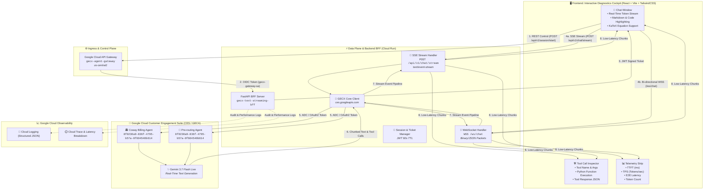

# GECX Real-Time Text Streaming & Cockpit Console Solution Design Document (SDD)

## Document Control

### Document Metadata
| Field | Value |
| :--- | :--- |
| **Document Title** | GECX Real-Time Text Streaming BFF & Interactive Diagnostics Cockpit SDD |
| **Project Code** | `04.gecx-text-streaming` |
| **Author(s)** | Junghyun Ko |
| **Date** | Aug 25, 2026 |
| **Status** | Draft Approved for Implementation |
| **Target Audience** | Cloud Solution Architects, AI/ML Engineers, Frontend Developers, SRE & Telemetry Teams |
| **Reference Baseline** | `02.gecx-streaming-api` Voice Streaming Architecture |

---

## 🖼️ High-Fidelity System Architecture Diagram



---

## 📌 1. 솔루션 개요 및 핵심 목표 (Solution Overview & Goals)

### 1.1. 프로젝트 개요
`04.gecx-text-streaming`은 Google Cloud Customer Engagement Suite (CES / GECX)의 **실시간 텍스트 스트리밍 추론(`runSession` / `BidiRunSession` Text Mode)**을 웹 챗봇 클라이언트에 초저지연으로 중계하는 **하이브리드 BFF(Backend-for-Frontend) 게이트웨이** 및 **진단형 인터랙티브 콕핏 웹 콘솔** 구축 프로젝트입니다.

### 1.2. 핵심 설계 원칙
1. **하이브리드 스트리밍 프로토콜 (SSE + WebSocket)**:
   * **Server-Sent Events (`text/event-stream`)**: 웹 브라우저 친화적, HTTP/2 멀티플렉싱 최적화, 간결한 단방향 스트리밍.
   * **WebSocket (`/ws/chat`)**: 지속적 양방향 세션 및 세션 인터럽션/Barge-in 지원.
2. **초저지연 TTFT (Time-To-First-Token)**:
   * 사용자 텍스트 전송 후 첫 번째 텍스트 토큰 표출까지 **500ms 미만** 달성.
   * 스트리밍 텍스트의 부드러운 타자기 렌더링 및 자동 스크롤.
3. **도구 호출(Tool Call) 실시간 시각화**:
   * Agent가 Python Code Tool, Knowledge Search, System Tool 등을 호출할 때 실행 인자와 반환 결과를 실시간 인스펙터 패널에 즉시 표출.
4. **동적 다중 에이전트 전환 (Multi-Agent Switcher)**:
   * 코웨이 요금/청구 에이전트(`83281339-...`) 및 사전 라우팅 에이전트(`8f0230a9-...`)를 런타임에 손쉽게 선택/스위칭.
5. **엔터프라이즈 보안 및 제어/데이터 플레인 분리**:
   * API Gateway(Control Plane) + Private Cloud Run BFF(Data Plane) + 단기 서명 JWT 티켓(60s TTL).

---

## 🗺️ 2. GCP 사전 정의 리소스 및 환경 매트릭스 (Predefined Resources)

| 리소스 구분 | 식별자 / 경로 | 사양 및 역할 |
| :--- | :--- | :--- |
| **GCP Project** | `gemeni-workshop` (Number: `329992103474`) | 전체 리소스 호스팅 프로젝트 |
| **Region / Location** | `us-central1` / `us` | Cloud Run 및 GECX 리전 |
| **기본 Agent 1 (Coway Billing)** | `8f0230a9-836f-4795-b57a-0f604540b614` | 코웨이 요금/청구 전문 AI 가상 상담원 |
| **확장 Agent 2 (Pre-routing)** | `8f0230a9-836f-4795-b57a-0f604540b614` | 라우팅 및 다목적 인입 검증 에이전트 |
| **Agent 2 Deployment ID** | `0b7d820b-375b-4333-b2ed-474eb0b070a9` | API Connection 배포 버전 |
| **API Gateway** | `gecx-agent-gateway` (`us-central1`) | Control Plane REST 엔드포인트 |
| **Cloud Run Service (신규)** | `gecx-text-streaming-bff` (`us-central1`) | 텍스트 스트리밍 BFF 컨테이너 |
| **IAM Service Account** | `gecx-bff-sa@gemeni-workshop.iam.gserviceaccount.com` | `roles/ces.client`, `roles/dialogflow.admin` |

---

## 📡 3. API 엔드포인트 및 데이터 프로토콜 명세 (Protocol Specification)

### 3.1. 제어 플레인: 세션 시작 및 티켓 발급 (Control Plane)
* **엔드포인트**: `POST /api/v1/session/start`
* **요청 (Request)**:
  ```json
  {
    "client_id": "web-cockpit-user",
    "app_id": "8f0230a9-836f-4795-b57a-0f604540b614",
    "session_id": "optional-custom-session-id"
  }
  ```
* **응답 (Response)**:
  ```json
  {
    "session_id": "sess_8f9a2b1c4e",
    "ticket": "eyJhbGciOiJIUzI1NiIsInR5cCI6IkpXVCJ9...",
    "expires_in": 60,
    "sse_endpoint": "/api/v1/chat/stream",
    "ws_endpoint": "/ws/chat"
  }
  ```

---

### 3.2. 데이터 플레인 A: Server-Sent Events (SSE) 스트리밍
* **엔드포인트**: `POST /api/v1/chat/stream`
* **헤더**:
  * `Content-Type: application/json`
  * `Authorization: Bearer <TICKET_OR_TOKEN>`
  * `Accept: text/event-stream`
* **요청 본문 (Request Body)**:
  ```json
  {
    "session_id": "sess_8f9a2b1c4e",
    "message": "지난달 정수기 렌탈료 청구 내역 알려줘",
    "app_id": "8f0230a9-836f-4795-b57a-0f604540b614"
  }
  ```
* **SSE 이벤트 스트림 형식 (`text/event-stream`)**:
  ```text
  event: start
  data: {"session_id":"sess_8f9a2b1c4e","timestamp":1787578000.123}

  event: tool_call
  data: {"tool_name":"get_billing_history","args":{"customer_no":"1820116208"},"call_id":"tool-001"}

  event: tool_response
  data: {"call_id":"tool-001","result":{"total_amount":34900,"due_date":"2026-08-25"}}

  event: text_chunk
  data: {"delta":"고객님의 ","sequence":1}

  event: text_chunk
  data: {"delta":"지난달 렌탈료는 ","sequence":2}

  event: text_chunk
  data: {"delta":"34,900원입니다.","sequence":3}

  event: telemetry
  data: {"ttft_ms":312,"tps":42.5,"total_tokens":68,"total_latency_ms":1420}

  event: end
  data: {"finish_reason":"STOP"}
  ```

---

### 3.3. 데이터 플레인 B: WebSocket 양방향 스트리밍
* **엔드포인트**: `WSS /ws/chat?ticket=<JWT_TICKET>`
* **클라이언트 전송 메시지**:
  ```json
  {
    "type": "user_message",
    "session_id": "sess_8f9a2b1c4e",
    "text": "카드 납부로 변경하고 싶어"
  }
  ```
* **서버 푸시 이벤트**:
  * `text_chunk`: 실시간 텍스트 토큰 조각
  * `tool_call` / `tool_result`: 도구 실행 상태
  * `telemetry`: 턴 완료 메트릭

---

## 🏗️ 4. 백엔드 BFF 아키텍처 상세 설계 (Backend Design)

### 4.1. BFF 디렉토리 및 모듈 구성
```text
04.gecx-text-streaming/
├── bff/
│   ├── __init__.py
│   ├── main.py              # FastAPI 서버, CORS, REST/SSE/WS 라우팅
│   ├── gecx_text_client.py  # Google CES API 스트리밍 클라이언트 (OAuth2 ADC)
│   ├── sse_manager.py       # Event-Stream 제너레이터 및 청크 패커
│   ├── ws_manager.py        # WebSocket 세션 커넥션 풀 및 생명주기 관리
│   ├── auth.py              # 60초 TTL JWT 티켓 발급 및 서명 검증
│   ├── telemetry.py         # TTFT, TPS, 레이턴시 마이크로초 벤치마커
│   └── config.py            # 환경변수 로더 및 다중 에이전트 경로 빌더
├── web/                     # React + Vite + TailwindCSS 프론트엔드
├── scripts/
│   ├── setup_env.sh         # 의존성 설치 및 가상환경 구성
│   ├── run_local.sh         # 로컬 원클릭 기동 (BFF + Web)
│   └── deploy_cloudrun.sh   # Cloud Run 프로덕션 배포 스크립트
├── Dockerfile               # Multi-stage 프로덕션 컨테이너 빌더
├── requirements.txt         # Python 의존성 (fastapi, uvicorn, google-auth, pydantic)
└── docs/
    └── sdd.md               # 본 솔루션 설계서
```

### 4.2. GECX 스트리밍 클라이언트 (`gecx_text_client.py`) 핵심 로직
1. **Application Default Credentials (ADC)** 기반 자동 Bearer 토큰 주입 (`google.auth.default`).
2. `https://ces.googleapis.com/v1beta/{resource_path}/sessions/{session_id}:runSession` 스트리밍 gRPC/HTTP 스트림 파싱.
3. 수신된 JSON 응답에서 `chunks.text`, `chunks.toolCall`, `chunks.toolResponse`를 비동기 제너레이터(`async for chunk in stream`)로 분리 추출하여 실시간 브로드캐스팅.

---

## 💻 5. 프론트엔드 콘솔 UI/UX 설계 (Frontend Design)

### 5.1. 2열 스플릿 콕핏 레이아웃 (Split Cockpit)
* **좌측 (Main Chat Area - 60% 폭)**:
  * 모던 헤더: 에이전트 전환 드롭다운 (코웨이 요금봇 / Pre-routing 봇 / 직접입력)
  * 스트리밍 챗 뷰: 사용자 발화 버블 + 어시스턴트 마크다운 버블 (실시간 타자기 효과)
  * 프롬프트 입력창: Enter 발송, Shift+Enter 줄바꿈, 세션 초기화(Clear) 버튼
* **우측 (Diagnostics & Telemetry Deck - 40% 폭)**:
  * **Card 1. 실시간 텔레메트리 뱃지**:
    * ⚡ **TTFT (Time-to-First-Token)**: `312 ms` (목표: < 500ms)
    * 🚀 **TPS (Tokens Per Second)**: `45.2 tps`
    * ⏱️ **E2E Latency**: `1.24 s`
    * 🔢 **Total Tokens**: `128 tokens`
  * **Card 2. Tool Call Inspector (실시간 도구 감시창)**:
    * 도구명 (`get_billing_history`, `greeting` 등)
    * 주입된 파라미터 (JSON 트리)
    * 백엔드 실행 시간 (ms) 및 반환 결과

---

## 🔐 6. 보안 및 IAM 아키텍처 (Security & Access Control)

1. **제어/데이터 플레인 분리**:
   * 클라이언트는 직접 비공개 Cloud Run URL에 접근하지 않고, API Gateway를 통해 OIDC 인증 후 단기 티켓을 획득.
2. **단기 서명 JWT 티켓 (Ephemeral Session Ticket)**:
   * 알고리즘: `HMAC-SHA256`
   * 유효기간: `60초` (세션 연결 후에는 메모리 세션으로 전환되어 탈취 공격 원천 차단)
3. **최소 권한 IAM**:
   * BFF 서비스 계정(`gecx-bff-sa`): `roles/ces.client` 역할만 부여하여 GECX 대화 세션만 호출 가능하도록 격리.

---

## 📈 7. 성능 SLA 및 텔레메트리 목표 (Performance SLA)

| 측정 지표 | 목표 SLA | 모니터링 방식 |
| :--- | :--- | :--- |
| **TTFT (Time To First Token)** | **< 450 ms** (p95) | 클라이언트 전송 시점 ~ 첫 `text_chunk` SSE 수신 간격 (마이크로초) |
| **TPS (Generation Speed)** | **> 35 tokens/s** | 토큰 수 / (완료 시간 - 첫 토큰 수신 시간) |
| **BFF 오버헤드** | **< 15 ms** | BFF 내부 청크 파싱 및 직렬화 지연 |
| **동시 세션 지원** | **100+ Sessions / Instance** | FastAPI 비동기(Asyncio) Non-blocking 이벤트 루프 |

---

## 🚀 8. 구현 로드맵 (Implementation Roadmap)

1. **Step 1 [SDD 문서 승인 & 기반 디렉토리 구성]** ⬅️ *(현재 단계 완료)*
2. **Step 2 [BFF 백엔드 구현]**: FastAPI 서버, GECX 텍스트 스트리밍 클라이언트, SSE/WS 핸들러, JWT 인증 모듈 작성.
3. **Step 3 [웹 프론트엔드 콘솔 구현]**: React + Vite + TailwindCSS 챗봇 UI, 마크다운 렌더러, Tool Call Inspector, 실시간 텔레메트리 스트립.
4. **Step 4 [단위 및 통합 스트리밍 테스트]**: Python Mock/Live GECX 연결 검증 및 스트리밍 레이턴시 벤치마크.
5. **Step 5 [Cloud Run 배포 및 연동 검증]**: 컨테이너 빌드, Cloud Run 배포, 엔드투엔드 텍스트 대화 검증.

---
