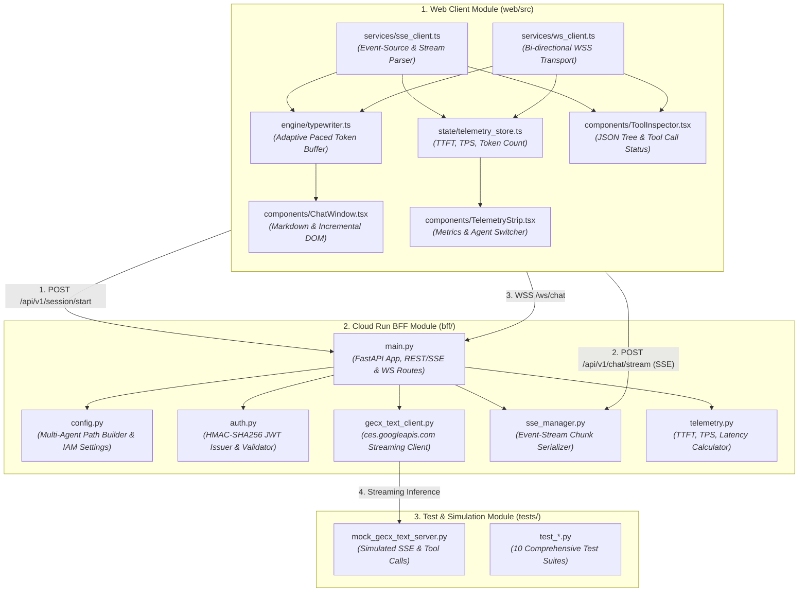
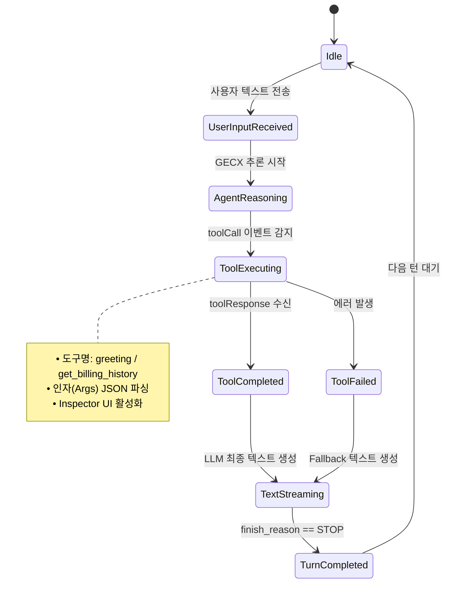

# GECX Real-Time Text Streaming Technical Design Document (TDD)

## Document Control

### Document Metadata
| Field | Value |
| :--- | :--- |
| **Document Title** | GECX Real-Time Text Streaming & Cockpit Console Technical Design Document (TDD) |
| **Project Code** | `04.gecx-text-streaming` |
| **Author(s)** | Junghyun Ko |
| **Date** | Aug 25, 2026 |
| **Status** | Approved Draft (Ready for Implementation) |
| **Target Audience** | Backend/Frontend Engineers, AI Platform Architects, SRE & Telemetry Engineers |
| **Parent Architecture** | Solution Design Document ([`sdd.md`](sdd.md)) |

---

## 1. System Module Architecture & Class Diagram

### 1.1. Module Dependency & Layered Architecture



---

## 2. Adaptive Paced Typewriter Algorithm (적응형 타자기 렌더링 엔진)

### 2.1. Burst Mitigation & Dynamic Delay Mathematics
LLM 스트리밍 응답은 네트워크 지연 및 토큰 배치 생성으로 인해 청크가 불규칙한 덩어리(Burst, 예: 1회에 10~20단어 유입)로 수신됩니다. 이를 인간적인 속도로 부드럽게 표출하고 큐 지연(Backlog)을 방지하기 위한 적응형 지연 알고리즘을 적용합니다.

#### 동적 프레임 지연 계산 공식:
$$T_{\text{delay}}(Q) = \max\left(T_{\text{min}}, \frac{T_{\text{base}}}{1 + \alpha \cdot \max(0, |Q| - Q_{\text{threshold}})}\right)$$

* $T_{\text{base}}$: 기본 렌더링 간격 ($30\text{ ms}$)
* $T_{\text{min}}$: 최소 허용 지연 간격 ($5\text{ ms}$)
* $Q$: 현재 대기 중인 토큰/글자 큐 크기
* $Q_{\text{threshold}}$: 백로그 가속 임계값 ($15\text{ chars}$)
* $\alpha$: 가속 계수 ($0.08$)

```typescript
// web/src/engine/typewriter.ts
export class AdaptiveTypewriterEngine {
  private queue: string[] = [];
  private renderedText: string = "";
  private isRunning: boolean = false;
  private onUpdate: (text: string) => void;
  private onComplete: () => void;

  constructor(onUpdate: (text: string) => void, onComplete: () => void) {
    this.onUpdate = onUpdate;
    this.onComplete = onComplete;
  }

  public pushChunk(chunk: string): void {
    // 글자/단어 단위로 분할하여 큐에 삽입
    const chars = Array.from(chunk);
    this.queue.push(...chars);
    if (!this.isRunning) {
      this.isRunning = true;
      this.tick();
    }
  }

  private tick(): void {
    if (this.queue.length === 0) {
      this.isRunning = false;
      this.onComplete();
      return;
    }

    const nextChar = this.queue.shift()!;
    this.renderedText += nextChar;
    this.onUpdate(this.renderedText);

    // 적응형 지연 연산
    const backlog = Math.max(0, this.queue.length - 15);
    const delay = Math.max(5, Math.floor(30 / (1 + 0.08 * backlog)));

    setTimeout(() => this.tick(), delay);
  }

  public flush(): void {
    while (this.queue.length > 0) {
      this.renderedText += this.queue.shift()!;
    }
    this.onUpdate(this.renderedText);
    this.isRunning = false;
    this.onComplete();
  }
}
```

---

## 3. Data Models & Stream Protocol Serialization (Pydantic Models)

### 3.1. BFF Backend Pydantic Schemas (`bff/schemas.py`)

```python
from pydantic import BaseModel, Field
from typing import Optional, List, Dict, Any

class SessionStartRequest(BaseModel):
    client_id: str = Field(default="web-cockpit-user", description="클라이언트 고유 식별자")
    app_id: Optional[str] = Field(default=None, description="대상 CXAS 앱 ID (미입력 시 기본값)")
    session_id: Optional[str] = Field(default=None, description="커스텀 세션 ID")

class SessionStartResponse(BaseModel):
    session_id: str
    ticket: str
    expires_in: int = 60
    sse_endpoint: str = "/api/v1/chat/stream"
    ws_endpoint: str = "/ws/chat"

class ChatStreamRequest(BaseModel):
    session_id: str
    message: str
    app_id: Optional[str] = None
    deployment_id: Optional[str] = None

class ToolCallPayload(BaseModel):
    call_id: str
    tool_name: str
    args: Dict[str, Any]
    status: str = "executing" # executing, completed, failed

class ToolResponsePayload(BaseModel):
    call_id: str
    tool_name: str
    result: Dict[str, Any]
    duration_ms: float

class StreamTelemetry(BaseModel):
    ttft_ms: float
    tps: float
    total_tokens: int
    total_latency_ms: float
    model: str = "gemini-3.7-flash"
```

---

## 4. Tool Call Inspector & State Machine

Agent가 실행 중에 Python 코드 도구, Greeting 도구, 요금 조회 API 등을 호출할 때 상태를 추적하여 실시간 UI에 반영합니다.



---

## 5. Telemetry & Performance Calculation Mathematics

### 5.1. TTFT (Time-To-First-Token) 측정 수식
$$TTFT = t_{\text{first\_token\_received}} - t_{\text{user\_request\_dispatched}}$$
* $t_{\text{user\_request\_dispatched}}$: 클라이언트에서 SSE/WSS 전송을 시작한 고정밀 타임스탬프 (`performance.now()`).
* $t_{\text{first\_token\_received}}$: 첫 번째 `text_chunk` 이벤트가 도착한 시점.

### 5.2. TPS (Tokens Per Second) 롤링 계산
$$TPS = \frac{N_{\text{tokens}}}{t_{\text{stream\_end}} - t_{\text{first\_token\_received}}}$$
* 단어/글자 토큰 추정치: 한국어/영문 UTF-8 토크나이저 가중치 반영 ($N_{\text{tokens}} \approx \frac{\text{Character Count}}{3.2}$).

---

## 6. Comprehensive 10-Suite Testing Strategy (`tests/`)

본 솔루션은 실제 GCP 연결 없이도 로컬 환경에서 100% 자동 검증이 가능한 종합 테스트 스위트를 포함합니다.

| Suite | 파일명 | 테스트 내용 |
| :---: | :--- | :--- |
| **TS-01** | `test_jwt_auth.py` | 60초 TTL JWT 티켓 발급, 변조 탐지, 만료 검증 |
| **TS-02** | `test_typewriter_engine.ts` | 타자기 큐 버퍼 분할 및 적응형 가속 딜레이 검증 |
| **TS-03** | `test_sse_stream.py` | SSE Event-Stream 청크 직렬화 및 Keep-Alive 핑 검증 |
| **TS-04** | `test_ws_stream.py` | WebSocket 양방향 핸드쉐이크, 텍스트 패킷 송수신 |
| **TS-05** | `test_tool_inspector.py` | `toolCall` 및 `toolResponse` JSON 직렬화/역직렬화 |
| **TS-06** | `test_telemetry_math.py` | TTFT, TPS, 롤링 레이턴시 연산 정확도 |
| **TS-07** | `test_agent_switcher.py` | 다중 App ID 및 Deployment ID 동적 빌드 라우팅 |
| **TS-08** | `test_mock_gecx_server.py` | Mock CES 텍스트 스트리밍 서버 턴 생성 시뮬레이션 |
| **TS-09** | `test_e2e_sse_chat.py` | REST 세션 시작 ➡️ SSE 텍스트 스트림 ➡️ 턴 완료 E2E |
| **TS-10** | `test_error_handling.py` | 401 Unauthorized, 404 App Not Found, 504 Timeout 복구 |

---

## 7. Implementation File Tree

```text
04.gecx-text-streaming/
├── bff/
│   ├── __init__.py
│   ├── main.py              # FastAPI 서버 진입점
│   ├── config.py            # 환경 설정 및 App ID 빌더
│   ├── auth.py              # JWT 티켓 서명 및 인증
│   ├── schemas.py           # Pydantic 데이터 모델
│   ├── gecx_text_client.py  # Google CES 스트리밍 클라이언트
│   ├── sse_manager.py       # SSE 제너레이터
│   ├── ws_manager.py        # WebSocket 핸들러
│   └── telemetry.py         # 텔레메트리 벤치마커
├── web/
│   ├── index.html
│   ├── package.json
│   ├── vite.config.ts
│   ├── tailwind.config.js
│   └── src/
│       ├── App.tsx          # 2열 콕핏 메인 레이아웃
│       ├── engine/
│       │   └── typewriter.ts# 적응형 타자기 엔진
│       ├── services/
│       │   ├── sse_client.ts# SSE 스트림 파서
│       │   └── ws_client.ts # WSS 클라이언트
│       ├── components/
│       │   ├── ChatWindow.tsx
│       │   ├── ToolInspector.tsx
│       │   └── TelemetryStrip.tsx
│       └── state/
│           └── telemetry_store.ts
├── tests/
│   ├── mock_gecx_text_server.py
│   └── test_*.py
├── scripts/
│   ├── setup_env.sh
│   ├── run_local.sh
│   └── deploy_cloudrun.sh
├── Dockerfile
├── requirements.txt
└── docs/
    ├── sdd.md
    └── tdd.md
```
